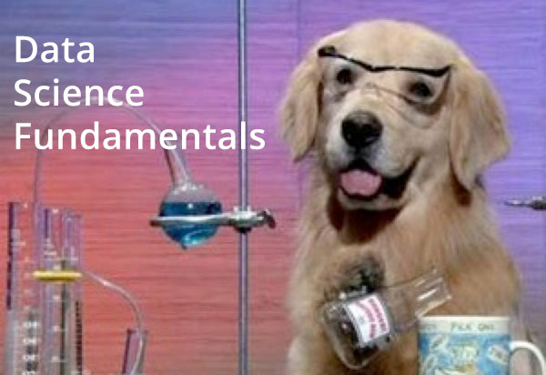

# 

## Table of contents
* [Essentials](#essentials)
* [Examples](#examples)
* [Exercises](#exercises)
* [Slides](#slides)
* [Resources](#resouces)

## Essentials
* **Teachers**: [Hay Kranen](mailto:hay.kranen@hu.nl) and [Jonas Moons](mailto:jonas.moons@hu.nl)
* [The course on learn.hu.nl](https://learn.hu.nl/course/view.php?id=798)
* [The master on learn.hu.nl](https://learn.hu.nl/course/index.php?categoryid=93)
* [Data-driven design Slack](https://datadrivendesign2018.slack.com/)
* **Deadline**: **Monday November 12th before 12:00** you hand in [the five assignments](https://learn.hu.nl/mod/book/view.php?id=41929&chapterid=3392) on your Github account and as [a zipfile on learn.hu.nl](https://learn.hu.nl/mod/assign/view.php?id=64659).
* [Cheatsheet](cheatsheet.md)
* [Students and their Github accounts](students.md)

### Examples
For every week there is a Jupyter Notebook containing examples relating to the subjects of that week
* [Week 1: Math, variables, `print()`, `input()`, comparisons, types, `if`, string methods](examples/examples-1.ipynb)
* [Week 2: Lists, `for`, `while`, files, `csv`](examples/examples-2.ipynb)
* [Week 3: dicts, `json`, f-strings, HTTP api's](examples/examples-3.ipynb)
* [Week 4: Reddit / `praw`, Pandas](examples/examples-4.ipynb)
* [Week 5: Web scraping](examples/examples-5.ipynb)

### Exercises
These are optional exercises you can make during the lesson to test your knowledge. You **don't** need to submit these with the final assignment.
* Week 1, lesson 1: [Myfitnesspal](exercises/myfitnesspal.ipynb) - [Student solutions](exercises/myfitnesspal.md)

### Slides
These are PDF versions of the slides i give every week.
* [Week 1, lesson 1](slides/dsf-w1l1.pdf)
* [Week 1, lesson 2](slides/dsf-w1l2.pdf)
* [Week 2, lesson 1](slides/dsf-w2l1.pdf)
* [Week 2, lesson 2](slides/dsf-w2l2.pdf)
* [Week 3, lesson 1](slides/dsf-w3l1.pdf)
* [Week 3, lesson 2](slides/dsf-w3l2.pdf)
* [Week 4, lesson 1](slides/dsf-w4l1.pdf)
* [Week 4, lesson 2](slides/dsf-w4l2.pdf)
* [Week 5, lesson 1](slides/dsf-w5l1.pdf)
* [Week 5, lesson 2](slides/dsf-w5l2.pdf)

### Resources and tips
*Feel free to [fork](https://help.github.com/articles/fork-a-repo/) this file and add more resources!*

#### Python
* [Extensive Python cheatsheet with examples](https://github.com/wilfredinni/python-cheatsheet#python-basics)
* [A more minimal cheatsheet](https://learnxinyminutes.com/docs/python3/)
* [Datacamp Python basics](https://campus.datacamp.com/courses/intro-to-python-for-data-science/chapter-1-python-basics)
* [A summary of the Python coding style](https://development.robinwinslow.uk/2014/01/05/summary-of-python-code-style-conventions/)
* [String methods and functions](https://www.digitalocean.com/community/tutorials/an-introduction-to-string-functions-in-python-3)
* [Datacamp introduction to lists](https://campus.datacamp.com/courses/intro-to-python-for-data-science/)
* [Working with JSON web API's](https://www.dataquest.io/blog/python-api-tutorial/)

#### Git and the terminal
* [Installing Git on Mac, Windows and Linux](https://git-scm.com/book/en/v2/Getting-Started-Installing-Git)
* [Basic terminal commands](http://newsourcemedia.com/blog/basic-terminal-commands/)
* [Basic Git commands](https://confluence.atlassian.com/bitbucketserver/basic-git-commands-776639767.html)
* [Interactive Git tutorial](http://git.rocks/getting-started/)
* [How to use terminal on Windows without going crazy…](https://gist.github.com/jirutka/99d57c82fa8981f56fb5)

#### Tips
* Google and [Stack Overflow](https://stackoverflow.com/) are your friends. It’s not a shame to Google even really basic concepts. I have been programming for more than twenty years and i still Google really basic stuff every single day.
* Your code should be properly commented (use `#`). Good commenting means you explain why you do something, not what you’re doing.
* Keep your code DRY: Do not Repeat Yourself. If you copy-paste code, you probably could use a function instead.
* Keep it tidy! Python is a language where indentation matters. This means that if you don’t format your code properly it won’t work.
* Make sure you all your code is correctly spelled. Python is very picky! If you write `If` instead of `if` (note the capital) your code won’t work.
* If you don’t understand why something isn’t working, try to make an example that is as simple as possible to pinpoint the cause.
* Pay close attention to the error output you get when you run a command. Google it if you don’t understand it.
* Note that Python is case sensitive and most file systems are too. When you create a new file only use lowercase characters, no spaces (use the underscore `_` instead).
* Read all the comments in the examples i provide. 90% of the things asked in the assignments are already solved for you there.